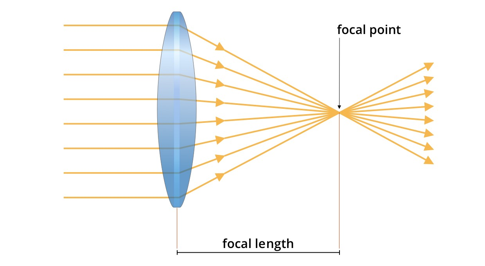
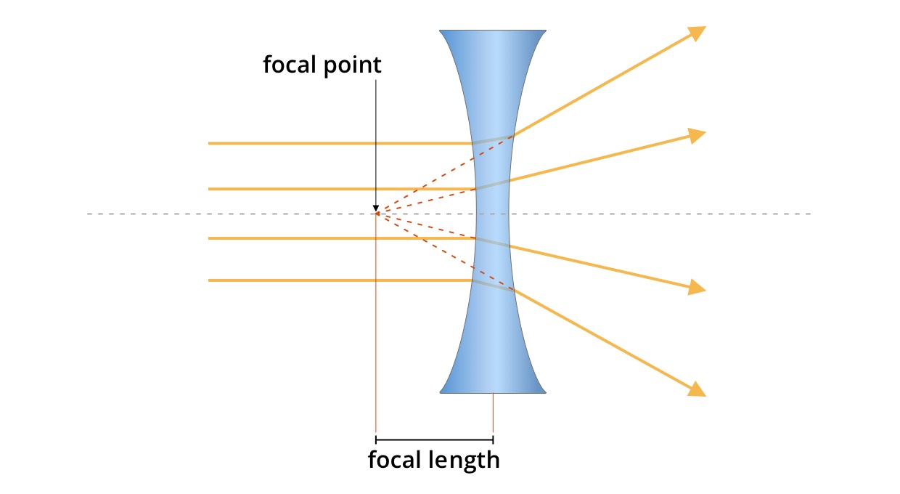
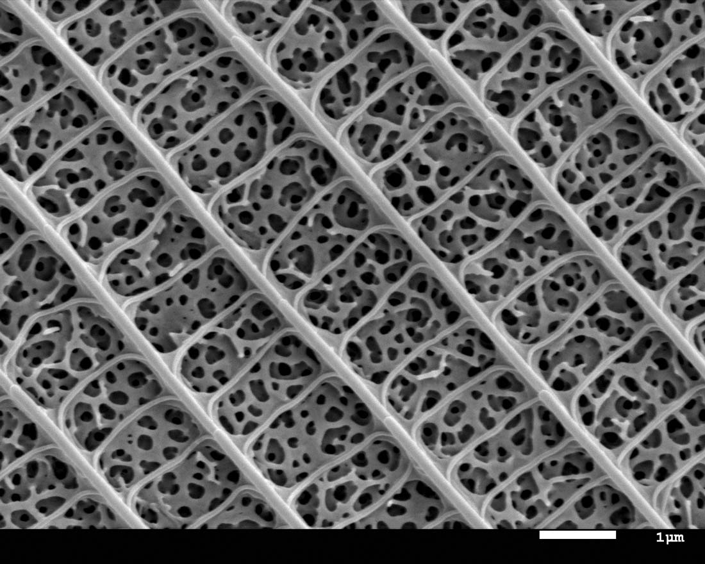
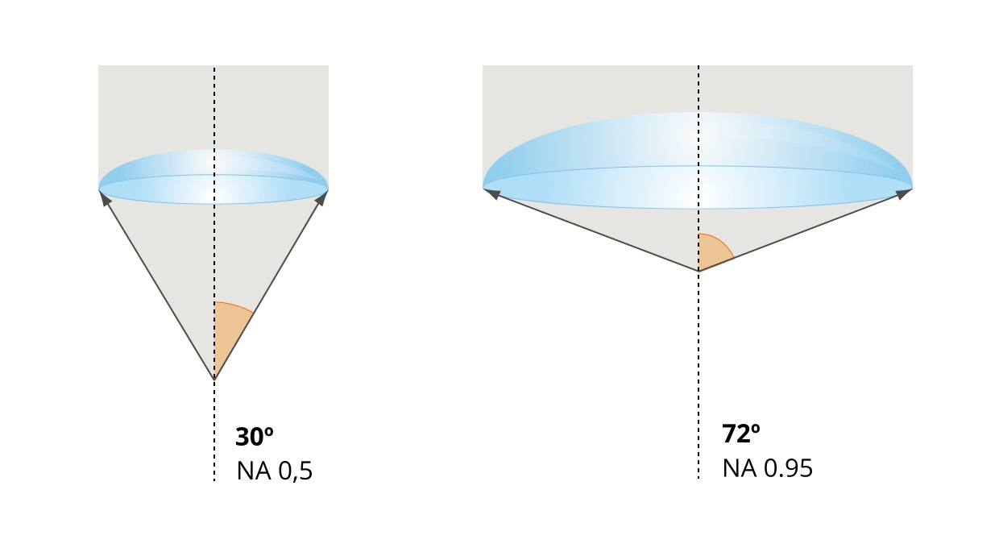

<!--
author:   Alexander Botzki

email:    alexander.botzki@vib.be

version:  0.1

language: en

icon: img/logo_VIB_noTagline.svg

narrator: US English Female

comment:  the course is based on the publication.

link:     https://cdn.jsdelivr.net/chartist.js/latest/chartist.min.css

script:   https://cdn.jsdelivr.net/chartist.js/latest/chartist.min.js

link: style.css

@orcid: [@0](@1)<!--class="orcid-logo-for-author-list"-->

-->

# Introduction to Microscopy

Hello and welcome, this is our interactive hands-on course about Microscopy Concepts.

> We are using the interactive Open Educational Resource online/offline course infrastructure called LiaScript. 
> It is a distributed way of creating and sharing educational content hosted on github.
> To see this document as an interactive LiaScript rendered version, click on the
> following link/badge:
>
> 

--------------------------------------------

*About VIB and VIB Technologies*

VIB is an entrepreneurial non-profit research institute, with a clear focus on groundbreaking strategic basic research in life sciences and operates in close partnership with the five universities in Flanders – Ghent University, KU Leuven, University of Antwerp, Vrije Universiteit Brussel and Hasselt University.

As part of the VIB Technologies, the 12 VIB Core Facilities, provide support in a wide array of research fields and housing specialized scientific equipment for each discipline. Science and technology go hand in hand. New technologies advance science and often accelerate breakthroughs in scientific research. VIB has a visionary approach to science and technology, founded on its ability to identify and foster new innovations in life sciences.

The goal of VIB Technology Training is to up-skill life scientists to excel in the domains of VIB Technologies, Bioinformatics & AI, Software Development, and Research Data Management.

--------------------------------------------

*Editorial team for this course*

Authors: Amanda Goncalves, @[orcid(Alexander Botzki)](https://orcid.org/0000-0001-6691-4233)

Contributors: Christof De Bo

Technical Editors: Alexander Botzki

Acknowledgements: https://www.myscope.training
  —— https://www.andresvasquez.net 

License: 

## What is Microscopy?

### Where it all started 

TODO: add image gallaries with some historical context about the image

 using a telescope, circa 1620")

[^1]: R. K. G. Temple, El Sol de Cristal: Tecnologías Perdidas de la Antigüedad, Oberon, Madrid (2000)

https://www.gettyimages.be/detail/nieuwsfoto%27s/italian-astronomer-and-physicist-galileo-galilei-using-a-nieuwsfotos/50965499

https://hips.hearstapps.com/hmg-prod/images/-galileo-galilei-1564---1642-using-a-telescope-circa-1620-photo-by-hulton-archivegetty-images.jpg?resize=1200:*

### Curiosity of the unseen

The development of microscopes has not stopped since the 1600s when Dutchman Antonie van Leeuwenhoek first recorded minute details in various natural samples examined with simple single lens microscopes that he had created using his knowledge of instrumentation and manipulating glass. Advances in specimen preparation and illumination have enabled researchers to refine and expand endeavours in the search for answers to the unknown. They have also extended the types of illumination from visible light to X-rays and electron beams so ever greater detail can be observed.

TODO: add other images and stories

### Best imaging setup 

The human eye is often used as a benchmark for imaging setups, including microscopy and telescopes. This is because early telescope designs were focused on improving the clarity and resolution of the human eye's natural vision. In the case of microscopy, modern instruments have been designed to mimic the function and structure of the human eye, enabling them to capture images with a similar level of detail and clarity. The use of the human eye as a reference point underscores the importance of visual perception in scientific observation and highlights the continued efforts to improve our ability to see and understand the world around us.

Here's a brief summary of the main functions of the components of the eye:

    Iris: The iris is the colored part of the eye that surrounds the pupil. It controls the amount of light that enters the eye by changing the size of the pupil.

    Cornea: The cornea is the clear, dome-shaped surface that covers the front of the eye. It plays a crucial role in focusing light onto the retina by bending light as it enters the eye.

    Lens: The lens is a transparent, flexible structure located behind the iris. It helps to focus light onto the retina by changing its shape to adjust for near or far vision.

    Retina: The retina is a layer of tissue at the back of the eye that contains photoreceptor cells called rods and cones. These cells convert light into electrical signals that are sent to the brain via the optic nerve.

    Fovea: The fovea is a small area located in the center of the retina that contains a high concentration of cone cells. This allows for detailed central vision, including color vision and visual acuity.

Each of these components work together to allow us to see and process visual information from the world around us.

[^1]: <a href="https://www.freepik.com/free-vector/diagram-human-eyeball-anatomy_13832801.htm#query=inside%20of%20eye&position=0&from_view=search&track=ais">Image by brgfx</a> on Freepik

### What's the deal with Optical Microscopy?

                {{0}}
*************************

Microscopy is the term that describes the use of lenses to reveal details of an object that are not visible to the unaided eye. A hand-held lens is the simplest way to do this, magnifying the details of a specimen.

Optical or light microscopy uses a system of lenses and visible light to create magnified and resolved images of small objects. 

We are most familiar with visible light as this is how we see the world around us in our daily lives. However, this visible light is just a small part of the much broader spectrum of electromagnetic radiation that is represented in the diagram below.

, the solar radiation at the outer edge of the earth's atmosphere (extraterrestrial sunlight, orange) and at sea level (terrestrial sunlight, rainbow-coloured)")

**************************

## Technological offering of the core 

                     {{1}}
***********

***********

The type of microscope you need to see your features of interest will depend on:

> * the size of your sample
> * the size of the features

the nature of the information you want to collect eg. do you want to determine:

> * what size or shape it is
> * where certain molecules are located
> * what its chemical composition is
> * or maybe the orientation of its crystals?

The availability of the instruments and the time it takes to become proficient in the technique also needs to be taken into account.

### Electromagnetic spectrum and microscopy

Different types of microscopy use different wavelengths to illuminate the samples and deliver different benefits and resolution. 

Optical Microscopy

Uses visible light to pass through, or reflect off, the sample.

Advantages:

    Uses visible light to illuminate a thin translucent sample using transmitted light or the surface of an opaque sample using reflected light.
    Magnification max - approx. 2000x.
    Direct imaging with no need of sample pre-treatment.
    The only microscopy for imaging the natural colour of a sample.
    Fast and adaptable to all kinds of sample systems, from gas to liquid and to solid sample systems in any shapes or geometries.
    Easy to be integrated with digital camera systems for data storage and analysis.

Scanning Electron Microscopy (SEM)

Uses an electron beam scanning across the surface of the sample.

Advantages:

    Observe surfaces of objects at high resolution
    Magnification approx. 500,000x
    Almost all kinds of samples, conducting and non-conducting (conductive coating needed)
    Based on surface interaction (no requirement of electron-transparent sample)
    Imaging at all directions through x-y-z (3D) rotation of the sample
    Specialised SEM works directly on non-conductive samples

Disadvantages:

    Resolution, usually above a few tens of nanometres
    Usually requires surface metal-coating to make the sample electrically conductive.

Transmission Electron Microscop (TEM)

Uses an electron beam passing through the sample
Advantages:

    Can observe very thin cross-sections of an object
    Magnification approx. 5,000,000x
    High resolution, as small as 0.2nm
    Direct imaging of internal structure of objects after preparation
    Direct imaging of crystal lattices in samples
    Can delineate the defects in a crystalline sample
    Using the electron diffraction technique you can determine the type of crystal structure (phase identification), symmetry determination, lattice parameter measurements, disorder and defect identification.

Disadvantages:

    To prepare an electron-transparent sample from larger pieces of starting material is difficult (due to the conductivity or electron density, and sample thickness).

## Anatomy of a microscope

In the most basic form, a microscope is made up of a lens, used near the eye and a tube that has another lens set further away from the eye but closer to the object. The object to be studied needs preparation, placement and illumination.

TODO: add image from powerpoint

An upright microscope and an inverted microscope are two types of optical microscopes that are used to observe small specimens such as cells or microorganisms.

An upright microscope, also known as a compound microscope, is designed so that the specimen is placed on a glass slide, and the light source and condenser are located below the specimen. The light passes through the specimen and is magnified by the lenses to produce an enlarged image. When using an upright microscope for cell biology applications, the samples are squeezed between the coverslip and a slide. This allows the sample to be successfully viewed and analyzed with the upright microscope from above. Upright microscopes are commonly used in biological research, clinical diagnosis, and education.

On the other hand, an inverted microscope is designed so that the specimen is placed on a culture dish, and the light source and lenses are located above the specimen. The light passes through the bottom of the dish or slide and then through the specimen, and the lenses magnify the image from below. Inverted microscopes are commonly used in cell culture, microbiology, and tissue culture applications.

TODO: add image from powerpoint

Both types of microscopes have their advantages and disadvantages, and their choice depends on the specific application and the type of specimen being observed. In general, inverted microscopes are better suited for observing living cells or specimens that require a more complex set-up, whereas upright microscopes are better suited for observing fixed or stained specimens that require higher magnification.

### The heart of the microscope: Lenses and abberations

#### Lenses

A lens is a device that bends a beam of electromagnetic radiation either focusing or deflecting it. A lens can focus a beam to form an image, unlike a prism, which refracts a beam without focusing it. Lenses make things appear **larger**, smaller, or upside-down.
Lenses can be either transparent material, such as the glass or plastic used to focus visible light, or they can consist of rings of magnets for focussing beams of charged particles such as electrons.

Lenses for visible light are made from materials that can be polished or moulded to the desired shape. They can be made to be either convex or concave. Convex lenses bend light in towards a focal point whereas concave lenses diverge light. Lenses includes eyeglasses, contact lenses, cameras, projectors, microscope, telescopes, and magnifying glasses.

### Types of aberration

Aberrations are imperfections in the way lenses transmit and focus the illuminating beams. Understanding these aberrations is important for choosing the best lens to view your sample.
Over the last 300 years, high-end light microscopy objective lenses have developed to near perfection, while less expensive light microscopy objectives and electromagnetic lenses remain quite imperfect. There are many kinds of lens defects, but we will emphasise only those that limit microscope performance in substantial ways. These are unavoidable and it is necessary to learn how to use the microscope to minimise them. They are:
- Spherical aberration
- Chromatic aberration
- Astigmatism

Spherical aberration is the most significant in defining the performance of the objective lens. It is an inherent property of a simple lens and occurs because the lens is more powerful at the edge that in the centre. This results in an image that will not be perfectly sharp.

Chromatic aberration is also an inherent property of lenses and occurs because all lenses bend beams of different wavelengths to different extents: higher wavelengths (lower energies) are bent less. This is the same reason that a prism splits white light into a spectrum. White light is composed of the different colours (different wavelengths) of the visible spectrum. Similarly, electron beams emerge from the electron gun with a range of different wavelengths. The presence of chromatic aberration means that we cannot get all wavelengths in focus at the same time.

Astigmatism occurs when the beam is not perfectly round. This can occur when parts of the microscope column are not properly adjusted. In practice, it is more significant for electron microscopy than for light microscopy and is corrected by controllers during the focussing process.

### Overcoming aberrations

One way to overcome chromatic aberration is to try and get a beam as close as possible to a single wavelength. In light microscopy you can do this by using just one colour of light, and although this works well, if we always did this, we would be throwing out one of the great advantages of light microscopy - the ability to show different structures or substances in different colours.

In electron microscopy, monochromators are available on high-end electron microscopes that reduce the spread of wavelengths emerging from the electron gun. They can significantly improve the resolution that can be achieved.

Spherical aberration is most pronounced in wide lenses. As wide lenses typically give the best resolution, there is a trade off between spherical aberration and resolution. Spherical aberration becomes worse much more rapidly than the resolution increases.

In light microscopy, these aberrations must be corrected to make a usable high-NA lens. Fortunately, we can correct them, but it requires multiple optical elements, which is why high-NA objectives are expensive.

In electron microscopy, aberration-correctors for spherical aberration are available on high-end electron microscopes and significantly improve the resolution. Aberration-corrected transmission electron microscopes allows users to routinely reaching atomic resolution of crystalline samples.

### The soul of the microscope: Light

#### Wavelength, frequency and energy

The visible spectrum covers wavelengths from about 400 (blue) to 700 (red) nanometres. All other wavelengths in the electromagnetic spectrum are invisible. Low energy, long wavelengths, at about 3 metres are used to transmit FM Radio signals. X-rays cover a wide part of the spectrum extending out from the UV. Electron beams generated by electron microscopes sit at the high energy, short wavelength end of the spectrum around 2–4 picometres.

[^1]: <a href="https://seos-project.eu//earthspectra/earthspectra-c02-p12.html">Image from SEOS project</a>

The frequency of electromagnetic radiation is the number of waves per second. Higher frequency radiation has shorter wavelengths and higher energy. In microscopy, higher frequency radiation gives greater resolution because shorter wavelengths separate at a closer distance than longer wavelengths. 

TODO: Add small part about light and photons

## Interactions with Matter

### Huygens-Fresnel principe

TODO: 

The Huygens-Fresnel principle is a fundamental concept in optics that explains how light propagates through space and interacts with objects. It states that each point on a wavefront can be considered as a source of secondary spherical wavelets, which propagate outwards in all directions at the speed of light. These wavelets interfere with each other, and the resulting wavefront at a later time is the sum of all the individual wavelets at that time.

In other words, if a wavefront of light is interrupted by an obstacle or a slit, each point on the wavefront can be thought of as a new source of light waves. These waves then propagate outwards and interfere with each other to create a new wavefront. This principle can be used to explain a wide range of optical phenomena, such as diffraction, interference, and polarization.

The Huygens-Fresnel principle is named after two Dutch scientists, Christiaan Huygens and Augustin-Jean Fresnel, who independently proposed similar ideas in the 17th and 19th centuries, respectively. Their work laid the foundation for the modern understanding of wave optics and helped to establish the wave nature of light.

### Obstacles and 

TODO: explain types of interference

### Dubble slit experiment

TODO: add diffraction

### Other type of interactions

When a beam hits a sample a number of interactions can occur. Some type of interactions can be observed or measured to provide information about the sample. Many of these interactions occur at the same time but depending on the type of information you need, you can choose which ones to measure.

Absorption

Energy from the beam can be either fully or partially absorbed by the sample. The reduction of beam energy as it emerges from the sample can be measured.

Reflection and scattering off surfaces

Beams can bounce back when they encounter a sample in their path. If the surface of that sample is irregular, the beam bounces back at different angles depending on the orientation of the part it hits. This is called scattering. If the surface is flat, the beam can bounce back as a single coherent beam, as light does from a mirror. This is called reflection.
Technique examples: optical darkfield techniques, polarised light microscopy, reflectance microscopy.

Beam scattering within samples

High energy beams such as high energy X-rays and electron beams can penetrate the surface of samples and bounce around the electron cloud. This throws the beam in many directions and we refer to this as scattering. This effect can lead to the beam being dissipated in the sample or emerging, where it can be measured.

Transmission and refraction

Beams can pass through a sample. The extent to which they do this will depend on the thickness and density of the sample and the wavelength of the beam. Transmission is the basis of many microscopy techniques.

> Depending on the nature of the material, the beam can be bent by the sample as it passes through it. 
> This is called refraction. It is the change in direction of a wave passing from one medium to another when it comes at a certain
> angle. 

TODO: add image with pencil in glass of water

> Some refractive materials are used as lenses. How much a wave is refracted is determined by the change in the wave speed
> and the initial direction of the wave propagation relative to the direction of the change in speed.
> A measure of how much a given material bends the light is known as the refractive index. 
> The refractive index affects the resolution you
> can achieve with a given microscopy technique. Refractive index is also temperature dependent, which is
> important if your microscopy experiment uses altered temperatures. It can be significant in light microscopy
> for live cell work where differences even between 23 and 37 degrees Celsius can affect your results.   

TODO: add image refraction and reflection
source: https://www.oocities.org/rjwarren_stm/Physics_Notes/Unit1_Light.html (certificate error!)

TODO: add oil immerison and NA
source: https://www.oocities.org/rjwarren_stm/Physics_Notes/Unit1_Light.html (certificate error!)

| Material      | Refractive Index |
| :------------ | :--------------- |
| Air           | 1.00003          |
| Water         | 1.33             |
| Glycerin      | 1.47             |
| Immersion Oil | 1.515            |
| glass         | 1.52             |
| flint         | 1.66             |
| zircon        | 1.92             |
| diamond       | 2.42             |
| lead sulfide  | 3.91             |

#### Magnification and measurement

                --{{0}}
*************************

Magnification is the amount that the dimensions of an image are, or appear to be, enlarged compared to the same dimensions in the actual sample. How much you can see either through the eyepiece or on the screen is called the field of view (FOV).

**************************

Measuring the size of your sample, or features within your sample, by using microscopy can be done in different ways but all depend on knowing the extent of magnification in one way or another. Magnification was described above and is controlled by the objective lens in the microscope. This is the lens nearest to the sample. The higher the magnification, the smaller the field of view will be.
The magnification is determined by the power of the eyepiece (or camera factor) times objective power.

Describing an image as showing a given magnification only applies to a fixed display size. If an image is enlarged, then so is its magnification. When images were captured onto a fixed-sized photographic film negative, it was clear that the negative showed a certain magnification such as 200x or 50,000x and that any increase in size when an image was printed could easily be calculated and used to increase the magnification factor. Magnification for digital images is usually calibrated in the microscope software. If it hasn’t been, or to check the calibration, capture an image of a stage micrometer. You can then determine the pixel size by looking at how many pixels in the image cover a measured distance on the micrometer. In a light microscope, you can also use a haemacytometer for this if you don’t have a stage micrometer.

Other more effective ways to represent the extent of magnification, and therefore the size of features in the image, regardless of display size include:

- describing the horizontal field width (HFW). HFW means the width of the area captured in the image. You can then calculate the proportion of this that is taken up by your feature of interest. Note: micrometre is abbreviated as µm and nanometre as nm. For example, if the HFW is 25µm, and your feature of interest takes up 20% of the width of the image, then 25µm x 20% = 5µm. So, your feature is 5µm wide.

- use of a scale bar. These are often added by the instrument software and provide another easy way to calculate the size of different components in the image. When doing this, all measurements must be done on the image at the same dimensions – you can’t zoom in further if you have already made one of the measurements.

An example of such a calculation is as follows:

First measure the length of the scale bar (on screen or on a printed page). Say this comes to 11 mm. Then, measure the width of your feature of interest; in this case say it is the distance between the long ridges, which measures about 17.5 mm (on the screen or printed page). Next, note the length that the scale bar represents, which is 1 µm (the number next to the scale bar).

Divide the size of the feature by the measured length of the scale bar and multiply by the length represented by the scale bar. This will give you the real width of the feature: (17.5/11) x 1µm = 1.59µm.

#### Magnification is not useful without resolution

Resolution is the ability to see small, close together objects as distinctly separate.

 was received on July 8, 2015 and has been combined with lower-resolution color information from the Ralph instrument. Image Credit: NASA-JHUAPL-SWRI")
" )

Different lenses can allow the passage of the illuminating beam to different extents. The more illumination that passes through a lens, the greater the resolution of the system. In different microscopy techniques this is controlled in different ways. In lenses for visible light microscopy, lenses are manufactured so they can gather more or less light. The relative amount of light gathered by a lens is known as its numerical aperture (NA). The greater the NA number, the more light it gathers and the greater the resolution it gives. Higher NA lenses are also more expensive, and their effectiveness is limited by inherent aberrations. This has been described before.

 

TODO: add images and explanation with airy disc size
from olympus 

#### Diffraction and resolution are closely related

The closer two points are, the more oblique angle an angle of light it produces as compared to points that are further apart; specimens with more closely spaced points (fine detail) require an objective lens that can collect light from a wider angle.

TODO: add two image miniute 31 video

An objective with a large angular aperture can collect light from more oblique angles (the diffraction pattern produced by two closely spaced points). This lens will have a greater resolution than a lens with a lower numerical aperture.

TODO: add schema 31:18

#### Abbe criterion

Abbe's criterion describes how we define how much we can resolve with a given numerical aperture and wavelength. The theoretical limit of resolution on a light microscope is about 200 nanometres (half the wavelength of violet light).

TODO: add short explanation on 2n*sin(alpha)

### Lens design and nomenclature

Cross-section of an Zeiss microscope objective / compound lens
TODO: add more description here

Achromatic Objective Lenses- Achromatic objectives are are standard objectives found on microscopes entry level educational microscopes. Achromatic lenses have a 60-70% flat field which means the outer 40-30% of your field of view will be out of focus.

Semi-Plan Objective Lenses- Semi-Plan microscope objective lenses provide an 80% flat field of view.

Plan Achromat Objective Lenses- Plan Achromat objectives provide just about 100% flat field of view.

TODO: add diagrams (Zeis)

### Color coding of objectives

TODO: add illustrations from presentation

Zeiss illustration

## Calibrations

Any measurements made during imaging are only as accurate as the instrument calibration indicates. If absolute accuracy is critical to your research, regular calibrations against a standard reference would become part of your imaging routine. Standards can be grids, meshes, beads or objects with known dimensions and positions in space (for multi-dimensional imaging tools). These standards are produced and provided by such entities as the US National Institute of Standards and Technology (NIST).

## Köhler illumination

 was a German professor and early staff member of Carl Zeiss in Jena, Germany. He is best known for his development of the microscopy technique of Köhler illumination, an important principle in optimizing microscopic resolution power by evenly illuminating the field of view., photo from GLAM collaboration with Carl Zeiss Microscopy")<!--
style = "height: 100px;
         border: 10px solid;"
-->

TODO: add schema with the basic nomenclature

Step 1: Switch on the microscope and put a sample in the sample holder.

Step 2: Use the focus knob to focus the sample.

TODO: add video fragment (0:08 - 0:17)

Step 3: Open the condenser diaphragm. Close the field diaphragm.

TODO: add video fragment (0:20 - 0:25)

Step 4: Focus the field diaphragm. Do not touch the focus knob, but move the condenser up and down.

TODO: add video fragment (0:31 - 0:36) 

Step 5: Center the field diaphragm. Use the metal screws that stick out of the front of the condenser.

TODO: add video fragment (0:42 - 0:46) 

Step 6: Open the field diaphragm, until the entire field of view is illuminated. Do not open the field diaphragm further than this.

TODO: add video fragment (0:53 - 0:57)

Step 7: Take out an eyepiece and look down the tube.

TODO: add video fragment (1:00 - 1:06)

Step 8: Close the condenser diaphragm until 1/3 of the field is closed and 2/3 is open.

TODO: add sketch

Step 9: Put back the eyepiece and you are ready to examine your sample.

TODO: add end of clip

To evenly illuminate the field of view and reduce optical glare from the light source.

TODO: add images

### Conjugate plane

## Detectors and Cameras

Nowadays, many microscopes capture images on digital cameras. Cameras allow you to capture a visual representation of what you see down the eyepiece or on the screen. The quality of a digital image depends on the quality of the camera, namely on the number and brightness of the pixels.

There are two main types of cameras used in microscopy: charge-coupled devices (CCD) and complementary metal-oxide semiconductors (CMOS). In transmission electron microscopy these are gradually being replaced with direct-electron cameras, which give a sharper image.

Different types of camera technologies bring different benefits.

In light microscopy, another consideration when choosing cameras is whether or not they capture images in colour. If speed of image capture is important then a colour camera is very useful. If speed is not important, it is possible to capture each of the red, green and blue channels separately and combine them afterwards in image processing software.

The reason for this is that a colour camera uses four pixels to capture the colour information for each point: one for red, one for blue and two for green. This takes up a lot more of the pixels, making an image on a colour camera considerably less information rich than one taken on a monochrome camera of equivalent pixel capacity. A monochrome camera will give more information and a better signal to noise ratio for a given pixel capacity.

Signal-to-noise ratio is an important consideration in collecting all kinds of experimental data and is equally important in microscopy. If you are expecting low levels of signal to noise, camera choice is one area that can help maximise the meaningful signal that can be captured. Image analysis and processing can also help to distinguish your signal from background noise.

Detectors allow you to capture types of non-visual information from your sample such as those described above in the section on beam–sample interactions. Scanning techniques like scanning electron microscopy and confocal microscopy use detectors that collect information from each point that encounters the beam as it scans over the sample. These can then be assembled by the image processing software to construct an image of the sample.

Other types of detector are specifically designed to capture the information generated by many specialised techniques. Information from detectors can be combined with digital images from the camera to provide positional information about the data, correlating it with visible features on the sample.

When capturing digital images, cameras need to be set up so that they capture an appropriate bit depth to adequately collect the range of tones that contribute to the meaningful data you wish to acquire from your sample. The accuracy of a digital image is related to the accuracy of the conversion to its constituent black, white and grey levels. Bit depth determines the number of increments of grey levels in your image. The higher the bit depth the more shades of grey there are in the image and the more continuous the shading appears to the viewer. The trade off in capturing high bit depth image files is that they are much larger than lower bit depth files. This means that they take up more disc space to store and take longer, or are more difficult, to process.

Also keep in mind that if you have a high bit depth, you have more dynamic range to work with. For instance, if you have 12-bit detector and are only collecting signal in the bottom 100 grey levels, you aren’t taking advantage of the full dynamic range of the detector (4096 grey levels). If you have very dim and sensitive samples, a high dynamic range (16-bit) camera would be helpful because the signal only falls in the bottom thousand grey levels, which would be the bottom tens of grey levels on an 8-bit camera.

## Digital images

### Introducing digital images

Capturing microscopic images digitally provides great advantages in processing and analysis of your data. However, there are many factors that need to be considered to ensure that you get the most from your digital data.

File formats

Image file formats vary, most particularly in whether or not they lose information when saved. This is often described as lossy versus lossless. This is very important, especially if your image goes through repeated cycles of opening and saving, such as when you are editing images – each time an image is saved using a lossy method, more information is lost, leading to cumulative deterioration. Lossy file formats compress the images to make smaller files, usually smaller than lossless methods but this loss is irreversible. The main lossy, but very popular, file format for images is jpg. It has the ability to save with various levels of compression, from none, (lossless) to highly compressed and lossy.

Some commonly used lossless file formats used for images are tiff, png, bmp, raw and pdf.

Proprietary formats that are specific to different microscopes tend to hold the most information, including metadata and should be kept when collecting and organising your images. Copies can be saved in more convenient formats, but the originals should be retained. These proprietary formats can often be opened in software such as ImageJ where much image processing and analysis can be carried out.
Metadata

Metadata is information about the file and the conditions under which it was captured. It is stored within the image file and should be retained as part of the image for future reference. It is often saved in proprietary formats but not in others.
Bit depth

Bit depth (bits, bytes, dynamic range) was described above and should be set on the microscope when capturing your images. You can subsequently adjust the bit depth in image processing software (see above). We can only see about 100 grey levels, which is equivalent to 8-bit. However, if you add colour to the intensity levels using various look-up tables, you may be able to distinguish more details. 8-bit is fine for just looking at images of your sample and generally speaking you only need to choose 16-bit or higher if you need to analyse your data in complex ways that require the finer intensity level steps.
Histograms and Look-up Tables (LUTS)

Digital images are just a display of intensity values across a range of pixels. Here is an image of a dog and the pixel intensity values of a single pixel (f{0,0}) as well as a 16x16 square of pixels within the image (f{332:348, 293:309).

Image data can be displayed as a histogram of intensity values. This is incredibly useful when optimising camera or detector settings.

You can apply a Look-Up Table (LUT) to your image to help visualise your data. Here we are displaying the data with a linear magenta LUT. This means as the image intensity goes up, the magenta appears brighter.

The Rainbow LUT uses different colours across ranges of pixel intensities. The LUT editor shows how the colours change with each pixel intensity from 0 (upper left) to 255 (lower right).

Digital images can be displayed in many different ways using LUTs without actually changing the data. The intensity values haven’t changed…just the display. This is still 8-bit data from 0-255. There are lots of different LUTs. Here is a small sample.

Here is confocal image of Alexa568 labelling tissue. Down the eyepiece the tissue will look red/orange. So, we can colour it with a Red LUT.

But our eyes don’t see Red very well. We can only discern ~40 levels of red. But we captured 255 with an 8-bit detector. So, to make it clearer, we can use a GRAY LUT, in which our eyes can see over 100 levels. 

If we are trying to optimise detector settings, we may want to use a HiLo LUT that colours the undersaturated pixels (those with 0 intensity and therefore below the detection ability) BLUE and the saturated pixels (brighter than the detector can detect and therefore capped at 255) with RED.

You can see only a few RED (saturated) pixels and a few BLUE (undersaturated) pixels. This LUT makes it easy to optimise the detector settings to ensure you are not missing data from the bright or dim areas in the sample. Here you can see that with the linearly scaled histogram alone, you can’t tell if there are any saturated pixels. Even when scaled logarithmically, although you can tell some pixels are saturated, you don’t know where they are in the image and whether there is a bit of artifact or if it is actually the sample of interest that is saturated.

In X-ray micro-tomography LUTs can also be used to highlight and distinguish features of interest. Choice of LUTs can make a huge difference to how your data appears and it is possible to create your own LUT that is optimal for your sample, as has been done for the cat skull below.

LUTs are often supplied with instrument and image analysis software.

In electron backscatter diffraction (EBSD) and transmission Kikuchi diffraction (TKD) LUTs are used to visualise the crystal orientation data held in each pixel. In the images below, you can see how different LUTs show the data differently.

Colour

Colour cameras collect RGB colour images. Typically, a red image with intensities from 0-255, a green image with intensities from 0-255 and a blue image with intensities from 0-255. The colour histogram will actually be made up of three histograms.

Greyscale vs colour

This was discussed above with respect to cameras. If you only need monochrome images, saving them in greyscale makes the file sizes smaller for the same pixel dimensions. If you need colour images for analysis and for displaying on screen, RGB should be chosen. CMYK is only used when preparing images for print and this is usually handled by the graphic designers and printers when they are preparing manuscripts or other content for print. Converting from RGB to CMYK is changing from subtractive colour to additive colour and many fluorescent images can end up looking less vibrant in CMYK.
image description

Annex:

### Depth of field

Depth of field tells us how much you can get in focus at the same time. This is particularly important for thick and uneven specimens such as sponges, embryos and insects where we want the top and bottom of the object to both be in focus at the same time. The microscopy technique chosen needs to have the ability to have the depth of field you need to usefully visualise your sample.

Examples:

Absorption 
Technique examples: electron energy-loss spectroscopy (EELS), bright field light with stains

Beam scattering
Techniques examples: X-ray diffraction, High-angle annular dark-field TEM, small angle scattering.

Technique examples: bright-field transmitted light microscopy, bright-field TEM, phase contrast, transmitted light differential interference contrast (DIC).

    When a wave hits an opening, it spreads out on the other side. We call this diffraction. When there are many openings close together, the waves run into each other to form bright spots or peaks through constructive interference. These can be used to study materials. In microscopy, diffraction itself is used to study the structure of crystalline materials – the periodic structure of a crystalline solid acts as a diffraction grating, scattering an electron beam in a predictable manner.

    Technique examples: X-ray diffraction, electron diffraction, electron backscatter diffraqction (EBSD).
    Secondary emission occurs when a beam hits a sample and causes other particles to be emitted. These can be collected and used for imaging or analysis, or, ignored where other forms of emission are important. These secondary particles are generally of lower energy than the primary beam, but not always.

    Technique examples: – fluorescence, SEM, Secondary ion mass spectroscopy (SIMS).
    Staining is often used to generate contrast in transmission techniques. With very thin and transparent samples such as cells and tissue sections, some kind of staining or labelling is often necessary to enhance sample interactions with the beam to increase contrast and make features more visible. Stains tend to bind either generally or differentially to chemicals such as proteins, lipids or nucleic acids within the sample to absorb certain wavelengths, or to fluoresce, emitting at distinctive wavelengths. Examples are dyes, heavy metals and fluorescently labelled antibodies.

    Technique examples: histological stains such as haematoxylin and eosin, or toluidine blue for bright-field light microscopy, heavy metal staining such as osmium, or gold-labelled antibodies for TEM, fluorescent labelling for many fluorescence techniques.

## Nyquist sampling

When capturing images with a digital camera, the pixel size you choose relates to resolution of your final image. If you do not choose enough pixels you will not be able to capture enough of the data to accurately see the features you are interested in and artifacts such as aliasing can distort your image.

To work out the pixel size you need to achieve a given degree of resolution, Harry Nyquist calculated that you need at least 2.3 pixels for each unit of resolution that you need. For example, if you need to see a resolution of 1µm, then you need 2.3 pixels/µm to optimally capture an image of your sample.

Microscopy can be extremely useful for object tracking over time and observing dynamic processes. When capturing a time course, it is important to select the number of time points that provide experimentally meaningful information, but not so many that you risk damaging your sample through beam–sample interactions or end up collecting vast quantities of unnecessary data that requires processing and storage.