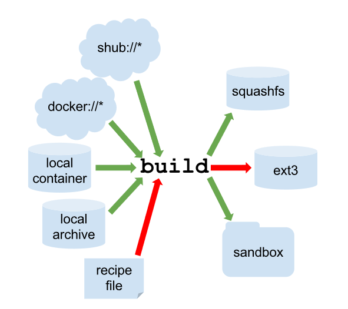

<!--
author:   Alexander Botzki
email:    Alexander.Botzki@vib.be
version:  0.1.1
language: en
narrator: US English Female

comment:  slides Docker Introduction

icon:     https://raw.githubusercontent.com/vibbits/nextflow-workshop/2024-liascript/docs/img/logo_VIB_noTagline.svg
logo:     https://raw.githubusercontent.com/vibbits/nextflow-workshop/2024-liascript/docs/img/logo_VIB_noTagline.svg

comment:  This document provide the resources for the Research Data Management Course

script:   https://cdn.jsdelivr.net/chartist.js/latest/chartist.min.js
          https://felixhao28.github.io/JSCPP/dist/JSCPP.es5.min.js

link:     https://cdn.jsdelivr.net/chartist.js/latest/chartist.min.css
link:     https://cdnjs.cloudflare.com/ajax/libs/animate.css/4.1.1/animate.min.css
link:     https://raw.githubusercontent.com/vibbits/material-liascript/master/img/org.css
link:     https://cdnjs.cloudflare.com/ajax/libs/font-awesome/5.11.2/css/all.min.css

@orcid: [@0](@1)<!--class="orcid-logo-for-author-list"-->

-->


# Introduction to Docker and Singularity


## Background about Docker

- Platform for developing, shipping and running applications
- First version: 2013
- Company. Original dotCloud (2010), later named Docker
- Established [Open Container Initiative](https://www.opencontainers.org/)

As a software:

- [Docker Community Edition](https://docs.docker.com/get-docker/)
- [Docker Enterprise Edition](https://www.docker.com/products/container-runtime)

## Docker Components

> A container is a standard unit of software that packages up code and all its dependencies so the application runs quickly and reliably from one computing environment > to another. A Docker container image is a lightweight, standalone, executable package of software that includes everything needed to run an application: code,
> runtime, system tools, system libraries and settings.
>
>  -- docker.com/what-container

Docker images are read-only templates, archive containing all the “data” needed to run the application. Containers are run from them, so they can be started and stopped and deleted without affecting the image. You can have many containers running the same image.


## Reproducibility stack


                         {{0}}
*******************************************


[^1](https://doi.org/10.1016/j.cels.2018.03.014)

********************************************

                                 --{{0}}--
****************************************
"Our reproducibility stack uses an example of the most basic RNA-seq analysis involving four tools. Our stack includes three components: (1) the cross-platform package manager Conda (https://conda.io) for installing analysis tools across operating systems, including virtualized environments that include all tools and dependencies at specified versions for performing a computational analysis, (2) lightweight software containers, such as Docker or Singularity, for using virtual environments and tool installations across different computing clusters, both local and in the cloud, and (3) hardware virtualization to achieve complete isolation and reproducibility. We have implemented this stack in the Galaxy scientific workbench (https://galaxyproject.org), enabling any Galaxy server to easily and automatically install all requirements for each Galaxy analysis workflow. This stack is also integrated into the CWL reference implementation. Integration of our reproducibility stack into Galaxy and CWL demonstrates, for the first time, how analysis workflows can be shared, rerun, and reproduced across platforms with no manual setup.
In conclusion, we are reaching the point where not performing data analyses reproducibly becomes unjustifiable and inexcusable. Aside from hardening the software, the main challenges ahead are in education and outreach that will be critical for fostering the next generation of researchers. There are also substantial cultural differences among research fields in the degree of software openness that will need to be tackled. We believe that this work is the first step toward making computational life sciences as robust as well-established quantitative and engineering disciplines."

*****************************************

## Quick comparison of virtualisation and containers

                 {{0-1}}
************************************************

<!-- width="100%"" -->


************************************************

                 {{1}}
************************************************

| Virtualisation | Containers |
|:--------------:|:----------:|
| very similar to a full OS | no need for full OS |
| high OS diversity | still OS dependant solutions |
| need of more space and resources |  easy solutions for distribution of recipes. high portability |
| slower than containers | easy to automate |
| not as good automation | not real OS in some cases |

************************************************


## So why does everyone love containers and Docker?

                 {{0-1}}
************************************************


- platform for developing, shipping, and running applications
- small, neat capsule containing your application
- infrastructure as application/code
- enables Continuous Integration, Continuous Development

************************************************

                 {{1}}
************************************************


- containers gives you instant application portability and easy to deploy in a cloud
- make applications and workloads more portable in an effective, standardized, and repeatable way
- Open Container Initiative
- Docker community edition

[^1](https://www.zdnet.com/article/what-is-docker-and-why-is-it-so-darn-popular/)
[^2](https://bigbionotes.blogspot.com/2019/11/elixir-support-development-of.html)
[^3](https://www.opencontainers.org/)

************************************************


## Docker basics

<!-- width="100%"" -->

            --{{0}}--
****************************
images are not run since they are read-only templates whereas containers are run from them.
****************************

## Docker image - building

* can be built from existing images
  * ubuntu, alpine
* base images can be created with tools such as debootstrap

<!-- width="100%"" -->

* any modification from the base image is a new layer ( tip: use && )
* images have several layers

## Docker image - instructions

- Recipe: Dockerfile
- Instructions
- FROM
- ADD, COPY
- RUN
- ENV PATH, ARG
- USER, WORKDIR, LABEL
- VOLUME, EXPOSE
- CMD, (ENTRYPOINT)

[Reference](https://docs.docker.com/engine/reference/builder/)

## Example from BioContainers

                 {{0-1}}
************************************************

```bash
################## BASE IMAGE ######################

FROM biocontainers/biocontainers:v1.0.0_cv4

################## METADATA ######################

LABEL base_image="biocontainers:v1.0.0_cv4"
LABEL version="2"
LABEL software="NCBI BLAST+"
LABEL software.version="2.2.31"
LABEL about.summary="basic local alignment search tool"
LABEL about.home="http://blast.ncbi.nlm.nih.gov/Blast.cgi?CMD=Web&PAGE_TYPE=BlastHome"
LABEL about.documentation="http://blast.ncbi.nlm.nih.gov/Blast.cgi?CMD=Web&PAGE_TYPE=BlastHome"
LABEL about.license_file="https://www.ncbi.nlm.nih.gov/IEB/ToolBox/CPP_DOC/lxr/source/scripts/projects/blast/LICENSE"
LABEL about.license="SPDX:MIT"
LABEL extra.identifiers.biotools="BLAST"
LABEL about.tags="Genomics"

################## MAINTAINER ######################

MAINTAINER Saulo Alves Aflitos <sauloal@gmail.com>

################## INSTALLATION ######################

RUN conda install blast=2.2.31

WORKDIR /data/
```

************************************************

                 {{1-2}}
************************************************

[repo for biocontainers base image](https://github.com/BioContainers/containers/blob/master/biocontainers/1.0.0/Dockerfile)

```
# Base image
FROM ubuntu:16.04

################## METADATA ######################

LABEL base_image="ubuntu:16.04"
LABEL version="4"
LABEL software="Biocontainers base Image"
LABEL software.version="1.0.0"
LABEL about.summary="Base image for BioDocker"
LABEL about.home="http://biocontainers.pro"
LABEL about.documentation="https://github.com/BioContainers/specs/wiki"
LABEL about.license_file="https://github.com/BioContainers/containers/blob/master/LICENSE"
LABEL about.license="SPDX:Apache-2.0"
LABEL about.tags="Genomics,Proteomics,Transcriptomics,General,Metabolomics"

################## MAINTAINER ######################
MAINTAINER Felipe da Veiga Leprevost <felipe@leprevost.com.br>

ENV DEBIAN_FRONTEND noninteractive

RUN mv /etc/apt/sources.list /etc/apt/sources.list.bkp && \
    bash -c 'echo -e "deb mirror://mirrors.ubuntu.com/mirrors.txt xenial main restricted universe multiverse\n\
deb mirror://mirrors.ubuntu.com/mirrors.txt xenial-updates main restricted universe multiverse\n\
deb mirror://mirrors.ubuntu.com/mirrors.txt xenial-backports main restricted universe multiverse\n\
deb mirror://mirrors.ubuntu.com/mirrors.txt xenial-security main restricted universe multiverse\n\n" > /etc/apt/sources.list' && \
    cat /etc/apt/sources.list.bkp >> /etc/apt/sources.list && \
    cat /etc/apt/sources.list

RUN apt-get clean all && \
    apt-get update && \
    apt-get upgrade -y && \
    apt-get install -y  \
        autotools-dev   \
        automake        \
        cmake           \
        curl            \
        grep            \
        sed             \
        dpkg            \
        fuse            \
        git             \
        wget            \
        zip             \
        openjdk-8-jre   \
        build-essential \
        pkg-config      \
        python          \
	python-dev      \
        python-pip      \
        bzip2           \
        ca-certificates \
        libglib2.0-0    \
        libxext6        \
        libsm6          \
        libxrender1     \
        git             \
        mercurial       \
        subversion      \
        zlib1g-dev &&   \
        apt-get clean && \
        apt-get purge && \
        rm -rf /var/lib/apt/lists/* /tmp/* /var/tmp/*

RUN echo 'export PATH=/opt/conda/bin:$PATH' > /etc/profile.d/conda.sh && \
    wget --quiet https://repo.continuum.io/miniconda/Miniconda2-4.0.5-Linux-x86_64.sh -O ~/miniconda.sh && \
    /bin/bash ~/miniconda.sh -b -p /opt/conda && \
    rm ~/miniconda.sh

RUN TINI_VERSION=`curl https://github.com/krallin/tini/releases/latest | grep -o "/v.*\"" | sed 's:^..\(.*\).$:\1:'` && \
    curl -L "https://github.com/krallin/tini/releases/download/v${TINI_VERSION}/tini_${TINI_VERSION}.deb" > tini.deb && \
    dpkg -i tini.deb && \
    rm tini.deb && \
    apt-get clean

RUN mkdir /data /config

# Add user biodocker with password biodocker
RUN groupadd fuse && \
    useradd --create-home --shell /bin/bash --user-group --uid 1000 --groups sudo,fuse biodocker && \
    echo `echo "biodocker\nbiodocker\n" | passwd biodocker` && \
    chown biodocker:biodocker /data && \
    chown biodocker:biodocker /config

# give write permissions to conda folder
RUN chmod 777 -R /opt/conda/

# Change user
USER biodocker

ENV PATH=$PATH:/opt/conda/bin
ENV PATH=$PATH:/home/biodocker/bin
ENV HOME=/home/biodocker

RUN mkdir /home/biodocker/bin

RUN conda config --add channels r
RUN conda config --add channels bioconda

RUN conda upgrade conda

VOLUME ["/data", "/config"]

# Overwrite this with 'CMD []' in a dependent Dockerfile
CMD ["/bin/bash"]

WORKDIR /data
```

***********************

                 {{2}}
************************************************

Example from [Rocker](https://www.rocker-project.org/)

```
FROM rocker/r-ver:3.6.0

ARG RSTUDIO_VERSION
ENV RSTUDIO_VERSION=${RSTUDIO_VERSION:-1.2.1335}
ARG S6_VERSION
ARG PANDOC_TEMPLATES_VERSION
ENV S6_VERSION=${S6_VERSION:-v1.21.7.0}
ENV S6_BEHAVIOUR_IF_STAGE2_FAILS=2
ENV PATH=/usr/lib/rstudio-server/bin:$PATH
ENV PANDOC_TEMPLATES_VERSION=${PANDOC_TEMPLATES_VERSION:-2.6}

## Download and install RStudio server & dependencies
## Attempts to get detect latest version, otherwise falls back to version given in $VER
## Symlink pandoc, pandoc-citeproc so they are available system-wide
RUN apt-get update \
  && apt-get install -y --no-install-recommends \
    file \
    git \
    libapparmor1 \
    libcurl4-openssl-dev \
    libedit2 \
    libssl-dev \
    lsb-release \
    psmisc \
    procps \
    python-setuptools \
    sudo \
    wget \
    libclang-dev \
    libclang-3.8-dev \
    libobjc-6-dev \
    libclang1-3.8 \
    libclang-common-3.8-dev \
    libllvm3.8 \
    libobjc4 \
    libgc1c2 \
  && if [ -z "$RSTUDIO_VERSION" ]; then RSTUDIO_URL="https://www.rstudio.org/download/latest/stable/server/debian9_64/rstudio-server-latest-amd64.deb"; else RSTUDIO_URL="http://download2.rstudio.org/server/debian9/x86_64/rstudio-server-${RSTUDIO_VERSION}-amd64.deb"; fi \
  && wget -q $RSTUDIO_URL \
  && dpkg -i rstudio-server-*-amd64.deb \
  && rm rstudio-server-*-amd64.deb \
  ## Symlink pandoc & standard pandoc templates for use system-wide
  && ln -s /usr/lib/rstudio-server/bin/pandoc/pandoc /usr/local/bin \
  && ln -s /usr/lib/rstudio-server/bin/pandoc/pandoc-citeproc /usr/local/bin \
  && git clone --recursive --branch ${PANDOC_TEMPLATES_VERSION} https://github.com/jgm/pandoc-templates \
  && mkdir -p /opt/pandoc/templates \
  && cp -r pandoc-templates*/* /opt/pandoc/templates && rm -rf pandoc-templates* \
  && mkdir /root/.pandoc && ln -s /opt/pandoc/templates /root/.pandoc/templates \
  && apt-get clean \
  && rm -rf /var/lib/apt/lists/ \
  ## RStudio wants an /etc/R, will populate from $R_HOME/etc
  && mkdir -p /etc/R \
  ## Write config files in $R_HOME/etc
  && echo '\n\
    \n# Configure httr to perform out-of-band authentication if HTTR_LOCALHOST \
    \n# is not set since a redirect to localhost may not work depending upon \
    \n# where this Docker container is running. \
    \nif(is.na(Sys.getenv("HTTR_LOCALHOST", unset=NA))) { \
    \n  options(httr_oob_default = TRUE) \
    \n}' >> /usr/local/lib/R/etc/Rprofile.site \
  && echo "PATH=${PATH}" >> /usr/local/lib/R/etc/Renviron \
  ## Need to configure non-root user for RStudio
  && useradd rstudio \
  && echo "rstudio:rstudio" | chpasswd \
	&& mkdir /home/rstudio \
	&& chown rstudio:rstudio /home/rstudio \
	&& addgroup rstudio staff \
  ## Prevent rstudio from deciding to use /usr/bin/R if a user apt-get installs a package
  &&  echo 'rsession-which-r=/usr/local/bin/R' >> /etc/rstudio/rserver.conf \
  ## use more robust file locking to avoid errors when using shared volumes:
  && echo 'lock-type=advisory' >> /etc/rstudio/file-locks \
  ## configure git not to request password each time
  && git config --system credential.helper 'cache --timeout=3600' \
  && git config --system push.default simple \
  ## Set up S6 init system
  && wget -P /tmp/ https://github.com/just-containers/s6-overlay/releases/download/${S6_VERSION}/s6-overlay-amd64.tar.gz \
  && tar xzf /tmp/s6-overlay-amd64.tar.gz -C / \
  && mkdir -p /etc/services.d/rstudio \
  && echo '#!/usr/bin/with-contenv bash \
          \n## load /etc/environment vars first: \
  		  \n for line in $( cat /etc/environment ) ; do export $line ; done \
          \n exec /usr/lib/rstudio-server/bin/rserver --server-daemonize 0' \
          > /etc/services.d/rstudio/run \
  && echo '#!/bin/bash \
          \n rstudio-server stop' \
          > /etc/services.d/rstudio/finish \
  && mkdir -p /home/rstudio/.rstudio/monitored/user-settings \
  && echo 'alwaysSaveHistory="0" \
          \nloadRData="0" \
          \nsaveAction="0"' \
          > /home/rstudio/.rstudio/monitored/user-settings/user-settings \
  && chown -R rstudio:rstudio /home/rstudio/.rstudio

COPY userconf.sh /etc/cont-init.d/userconf

## running with "-e ADD=shiny" adds shiny server
COPY add_shiny.sh /etc/cont-init.d/add
COPY disable_auth_rserver.conf /etc/rstudio/disable_auth_rserver.conf
COPY pam-helper.sh /usr/lib/rstudio-server/bin/pam-helper

EXPOSE 8787

## automatically link a shared volume for kitematic users
VOLUME /home/rstudio/kitematic

CMD ["/init"]
```


************************************************

### How to run the docker image

```
 $ cd /home/user/workplace
 $ docker pull biocontainers/blast
 $ docker run biocontainers/blast blastp -help
 $ wget http://www.uniprot.org/uniprot/P04156.fasta    
 $ curl -O ftp://ftp.ncbi.nih.gov/refseq/D_rerio/mRNA_Prot/zebrafish.1.protein.faa.gz
 $ gunzip zebrafish.1.protein.faa.gz
 $ docker run -v /Users/yperez/workplace:/data/ biocontainers/blast makeblastdb -in zebrafish.1.protein.faa -dbtype prot
 $ docker run -v /Users/yperez/workplace:/data/ biocontainers/blast blastp -query P04156.fasta -db zebrafish.1.protein.faa -out results.txt
```

### Docker compose

on the command line: `docker-compose up -d --build`

docker-compose.yml

```
version: "3.7"

services:
  camel:
    container_name: api_web
    build:
      context: .
      dockerfile: ./.docker/CAMEL.Dockerfile
      args:
        - BUILD_DATE=${BUILD_DATE}
        - VCS_REF=${VCS_REF}
        - VERSION=${VERSION}
    ports:
      - "8888:80"
    restart: always
    volumes:
      - '.:/var/www/CAMEL'
      - './camel.conf:/var/www/CAMEL/api/Camel/camel.conf'
      - './CAMEL.sql:/tmp/CAMEL.sql'

  db:
    container_name: camel-database
    build:
      context: .
      dockerfile: ./.docker/DB.Dockerfile
    restart: on-failure
    environment:
      MYSQL_ROOT_PASSWORD: password
      MYSQL_DATABASE: CAMEL
      MYSQL_USER: camel
      MYSQL_PASSWORD: abcdef
```

## One tool, one image

- start from packages e.g. [pip/PyPI](https://pypi.org/), [CPAN](https://www.cpan.org/), or [CRAN](https://www.cran.org/)
- use versions for tools and images
- use ENV PATH instead of ENTRYPOINT
- reduce size as much as possible
- keep data outside the image/container
- check the license
- make your container discoverable e.g. biocontainers, quay.io, docker hub

## Recommendations

- Carefully define a set of tools for a given analysis
- Use tools from the Bioconda registry
- Adopt containers to guarantee consistency of results
- Use virtualization to make analyses “resistant to time”.

## About the BioContainers Architecture

                 {{0}}
************************************************

<!-- width="100%"" -->

[^1](https://onlinelibrary.wiley.com/doi/full/10.1002/pmic.201900147)
[^2](https://hub.docker.com/u/biocontainers)
[^3](https://quay.io/organization/biocontainers)
[^4](http://biocontainers.pro/regitry)

************************************************

                --{{0}}--
BioContainers architecture from the container request by the user in GitHub to the final container deposited in DockerHub and Quay.io. The BioContainers community in collaboration with the BioConda community defines a set of guidelines and protocols to create a Conda and Docker container including mandatory metadata, tests, and trusted images. The proposed architecture uses a continuous integration system to test and build the final containers and deposit them into public registries. All the Containers and tools can be searched from the BioContainers registry.

## Further reading

- [impact of docker containers on performance](https://peerj.com/articles/1273/)
- [container-based virtualization for HPC environments](https://arxiv.org/abs/1709.10140)
- recommendations on [containers](https://f1000research.com/articles/7-742/v1)
- [practical computational reproducibility in life sciences](https://www.biorxiv.org/content/early/2017/10/11/200683)

- software development + software operations
- automate and monitor

<!-- width="100%"" -->

# Singularity

Containers for HPC

<!-- width="100%"" -->

[^1](https://doi.org/10.1371/JOURNAL.PONE.0177459)
[^2](https://sylabs.io/docs/)

## Singularity vs Docker Architecture

Summarising:

* Docker -> Microservices
* Singularity -> HPC

<!-- width="100%"" -->

[^1](http://geekyap.blogspot.com/2016/11/docker-vs-singularity-vs-shifter-in-hpc.html)

## Singularity - Strengths

* No dependency of a daemon
* Can be run as a simple user
* Image/container is a file (or directory)
  * More easily portable

* Two type of images
  * Read-only (production)
  * Writable (development)

## Singularity - Weaknesses

* At the time of writing only good support in Linux

  * Not a big deal in HPC environments, though
  * will change soon with WSL 2 [^1](https://zillowtech.com/install-wsl2-windows-10.html/amp)

* For some use cases, you might need root account (or sudo)

## Finding and downloading a Singularity Container

              {{0}}
****************************
There are two main places that you can find containers that will work with singularity.

- https://singularity-hub.org/
- https://hub.docker.com

****************************

             --{{0}}--
The first time you use singularity it will by default put a `.singularity` folder in your home directory which on HPC systems commonly has limited storage space. Therefore it is important that you move that folder to a different location and then create a softlink from your home directory to the new location.


## Singularity - pull

```
singularity pull docker://sjackman/maker
singularity exec --bind $PWD ./maker.img maker --help
```

## Singularity - build

<!-- width="100%"" -->

[^1](http://singularity.lbl.gov/docs-build-container)

## Singularity - build

                  --{{0}}--
First off, it is important that modifying existing containers should only be done to avoid having to rebuild a container from scratch while optimizing the recipe file. The ultimate goal is for the container to be fully reproducible from the recipe file. However, there are some containers that can take 2 hours to build and if you forgot to add a folder to the PATH directory or other similarly simple mistakes, 2 hours is a long time to wait to verify the container is working properly.

               {{0}}
**************************
Build read-only image from Docker

```
singularity build debian.sif docker://debian
```

Build writable directory from Docker

```
singularity build --sandbox debiandir docker://debian
```

*****************************

## Singularity recipes - sections

Singularity Recipes have five main sections

* Header information
  * %labels :information about the container
  * %environment : environmental variables and modules to load.
  * %post : commands to run during the creation of the container
  * %runscript : program to run if the image is executed


## Singularity recipes - example with debootstrap

```
BootStrap: debootstrap
OSVersion: stretch
MirrorURL: http://ftp.fr.debian.org/debian/
Include: curl

%environment
    BLAST_PROGRAM=blastp
    BLASTDB=/blastdb
    export BLAST_PROGRAM BLASTDB

%post
    BLAST_VERSION=2.7.1
    cd /usr/local; curl --fail --silent --show-error --location --remote-name ftp://ftp.ncbi.nlm.nih.gov/blast/executables/blast+/2.7.1/ncbi-blast-${BLAST_VERSION}+-x64-linux.tar.gz
    cd /usr/local; tar zxf ncbi-blast-${BLAST_VERSION}+-x64-linux.tar.gz; rm ncbi-blast-${BLAST_VERSION}+-x64-linux.tar.gz
    cd /usr/local/bin; ln -s /usr/local/ncbi-blast-${BLAST_VERSION}+/bin/* .

%labels
    Maintainer vibbioinfocore
    Version 0.1.0

%runscript
    echo "Blast application!"
    exec $BLAST_PROGRAM "$@"
```

Note: In order to use the `debootstrap` build module, you must have `debootstrap` installed on your system.

## Singularity recipes - example with docker

```
BootStrap: docker
From: continuumio/miniconda:4.5.4

%environment
    PATH=/opt/conda/envs/blast-conda/bin:$PATH
    export PATH

%post
    PATH=/opt/conda/bin:$PATH
    export PATH
    conda env create -f /environment.yml && conda clean -a

%files
    environment.yml

%labels
    Maintainer Biocorecrg
    Version 0.1.0
```

[^1](http://singularity.lbl.gov/docs-recipes)

## Singularity recipes - example from Singularity hub

```
BootStrap: shub
From:ResearchIT/spack-singularity:openmpi

%labels
MAINTAINER severin@iastate.edu
APPLICATION genomeModules

%help
This container contains all the necessary programs to create genome modules.
See https://github.com/ISUGIFsingularity/genomeModules.git for more information

%environment
source /etc/profile.d/modules.sh
SPACK_ROOT=/opt/spack
export SPACK_ROOT
export PATH=$SPACK_ROOT/bin:$PATH
source /etc/profile.d/modules.sh
source $SPACK_ROOT/share/spack/setup-env.sh
export PATH=$SPACK_ROOT/isugif/utilities/bin:$SPACK_ROOT/utilities/wrappers:$PATH
#for d in /opt/spack/opt/spack/linux-centos7-x86_64/gcc-4.8.5/*/bin; do export PATH="$PATH:$d"; done

module load gmap-gsnap
module load bowtie2
module load bwa
module load gatk
module load bedtools2
module load samtools
module load picard
module load jdk
export _JAVA_OPTIONS="-Xmx100G"
module load parallel

%post
export SPACK_ROOT=/opt/spack
export SPACK_ROOT
export PATH=$SPACK_ROOT/bin:$PATH

yum -y install bc paste
yum clean all

export FORCE_UNSAFE_CONFIGURE=1

source $SPACK_ROOT/share/spack/setup-env.sh
spack install picard
spack install gmap-gsnap
spack install bowtie2
spack install bwa
spack install gatk
spack install bedtools2
spack install samtools
spack install parallel

#for d in /opt/spack/opt/spack/linux-centos7-x86_64/gcc-4.8.5/*/bin; do export PATH="$PATH:$d"; done


cd $SPACK_ROOT

%runscript
echo "This container contains a environment and all prequisite programs to run prepare_genome_modules.sh"
```

[^1](http://singularity.lbl.gov/docs-recipes)

## Singularity - run

Execute a command

```
singularity exec debian.sif /bin/echo 'Hello world'
singularity exec debian.sif env
```

Execute a command (with a clean environment)

```
singularity exec -e debian.sif /bin/echo 'Hello world';
singularity exec -e debian.sif env
```

Execute a shell

```
singularity shell debian.sif
```

Execute a command (with a clean environment)

```
singularity run debian.sif

./lolcow_latest.cif

singularity run library://sylabsed/examples/lolcow
```

**creating wrappers for the singularity commands**

```
new_assemblathon
---
#!/bin/bash

singularity exec ISUGIFsingularity-utilities-master.simg new_Assemblathon.pl
```

## Naming Schema

- Singularity suggests that you have a recipe named as Singularity.XXX Where XXX is usually the version number.
- These Recipe files are contained in individual github Repos with more descriptive names.
- On Singularityhub it will be OrganizationName/RepoName/recipeFilename
- On Github you will create a descriptive named repo for every singularity container you want to make and create a recipe file contained in that Repo starting with Singularity.

MIT license Copyright (c) 2018 Genome Informatics Facility
https://github.com/ISUgenomics/bioinformatics-workbook

## Singularity - volumes

```
singularity run -B /db/test:/blastdb blastwww.sif
```

## Singularity - services/instances

```
sudo singularity build blastmysql.sif Singularity
singularity run -B /db/test:/blastdb -B $(pwd)/config.json:/config/mysql.json blastmysql.sif
sudo singularity build mysql.sif Singularity.mysql
singularity exec -B /tmp/db:/var/lib/mysql mysql.sif mysql_install_db
singularity instance.start -B /tmp/db:/var/lib/mysql -B /tmp/socket:/run/mysqld mysql.sif mysql
singularity instance.list
singularity exec instance://mysql mysql -uroot -h127.0.0.1 -e "CREATE DATABASE blast; GRANT ALL PRIVILEGES
singularity instance.start -B /db/test:/blastdb -B $(pwd)/config.local.json:/config/mysql.json blastmysql.
singularity instance.list
singularity instance.stop blast
singularity instance.stop mysql
```

## Private Docker images

[link](https://www.sylabs.io/guides/3.2/user-guide/singularity_and_docker.html)

```
sudo singularity build privateimg.sif docker-daemon://privateimg:latest
```

```
sudo singularity build privateimg.sif docker-archive://privateimg.tar
```

## Further reading

* - Documentation of VSC [containers on HPC](https://vlaams-supercomputing-centrum-vscdocumentation.readthedocs-hosted.com/en/latest/software/singularity.html#)
* [The impact of Docker containers on the performance of genomic pipelines](https://www.ncbi.nlm.nih.gov/pubmed/26421241)
* [Performance evaluation of Conatiner-based Virtualisation for High performance computating Environments](https://arxiv.org/abs/1709.10140)


## what options are available

* for ad hoc workflows and tools: docker, singularity, make

* for ad hoc pipelines: shell scripts in github

* for (routine) pipelines: snakemake, Galaxy, nextflow (with tools from bioconda)

* for software tools: bioconda/biocontainers

* for lightweight application: jupyter notebooks

* ...

# Thanks

- Bioinfo Core at CRG  [slides](https://github.com/biocorecrg/C4LWG-2018/tree/master/slides)
- based on recommendation from [F1000](https://f1000research.com/articles/7-742/v1)
- https://github.com/ISUgenomics/bioinformatics-workbook
  Copyright (c) 2018 Genome Informatics Facility
